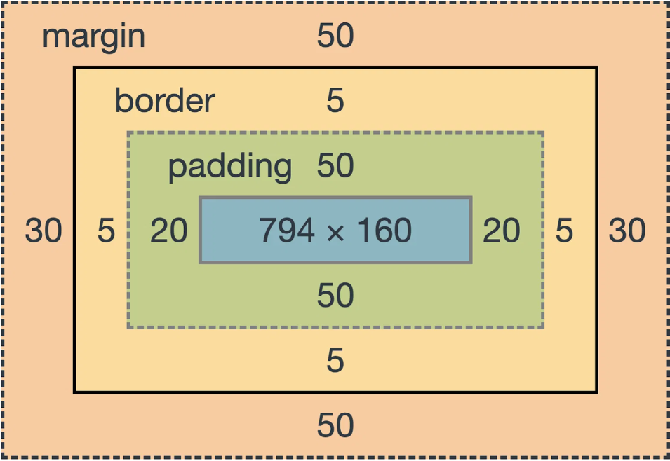
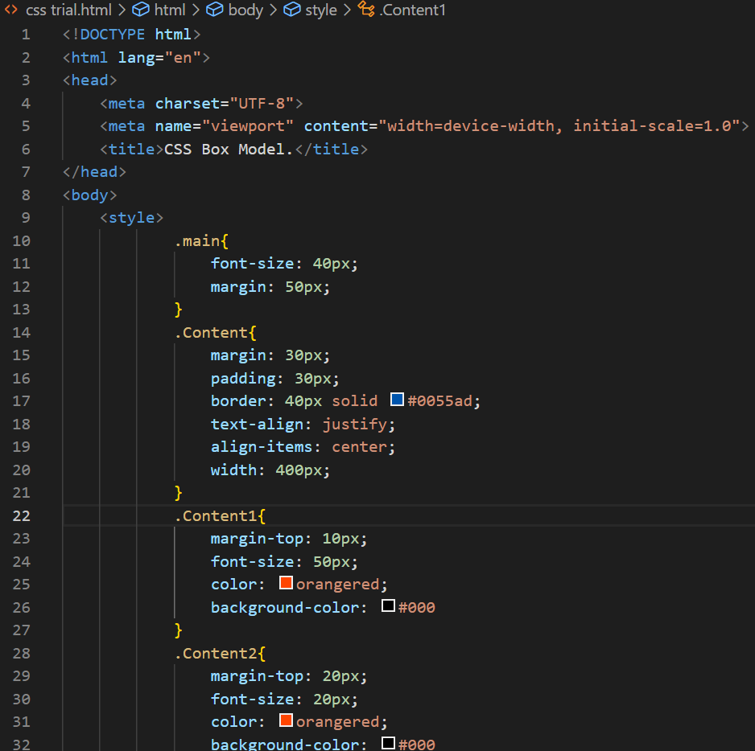
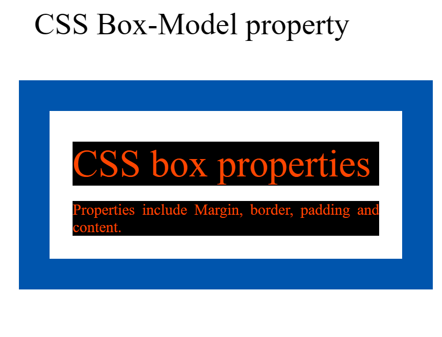

<!-- START doctoc generated TOC please keep comment here to allow auto update -->
<!-- DON'T EDIT THIS SECTION, INSTEAD RE-RUN doctoc TO UPDATE -->
**Table of Contents**  *generated with [DocToc](https://github.com/thlorenz/doctoc)*

- [CSS Box Model.](#css-box-model)
  - [What is CSS Box Model?](#what-is-css-box-model)
  - [Properties of the CSS Box Model.](#properties-of-the-css-box-model)
    - [Example of css code and the output.](#example-of-css-code-and-the-output)
  - [Conclusion](#conclusion)

<!-- END doctoc generated TOC please keep comment here to allow auto update -->

# CSS Box Model.
## What is CSS Box Model?
Before getting into CSS box model, we have to know what CSS is. CSS *(Cascading Style Sheets)* is a style sheet language for web page presentation and design, including colors, fonts, and layouts.  

Knowing what CSS is, next we look at the CSS box model.  
***Definition***- It is a container that contains multiple properties including margin, border, padding, and the content itself. It is used to create the design and layout of web pages.
According to the CSS box model, when run in the browser, it supplies each element as a square prism. Below is an illustration.   

   

## Properties of the CSS Box Model.     

Properties of CSS Model include;
- Margin - The outer most box. It clears an area outside the border. Margin tends to appear transparent hence does not have any color. Although, it shows the background color of the element, like the body element.

- Border -It is a visible or invisible line around the edge of the box that goes around the padding and content area. It can be applied to all the sides of the box or to selected sides - **top, right, bottom, and/or left**.

- Padding- It is the space between content and border, it clears the area around the content. It can be applied to all sides of the box or to the specific selected side- **top, right, bottom or left**.

- Content area- The content of the box, where text and images appear. The height and width properties help to modify the box dimensions.  

***Width and height of an element***   
It is **important** when you set the width and height properties of an element with CSS, you just set the width and height of the content area.

**Note**-The margin property also affects the total space that the box will take up on the page, but the margin is not included in the actual size of the box. The box's total width and height stops at the border.  

### Example of css code and the output.
Ideal example to help one understand the CSS box model better.      

   

The **output** of the above css will look like this;

## Conclusion
By following each step and understanding all the above information, you have now gained a very strong understanding of the CSS Box Model layout. This will help you to better align the elements on a web page.

